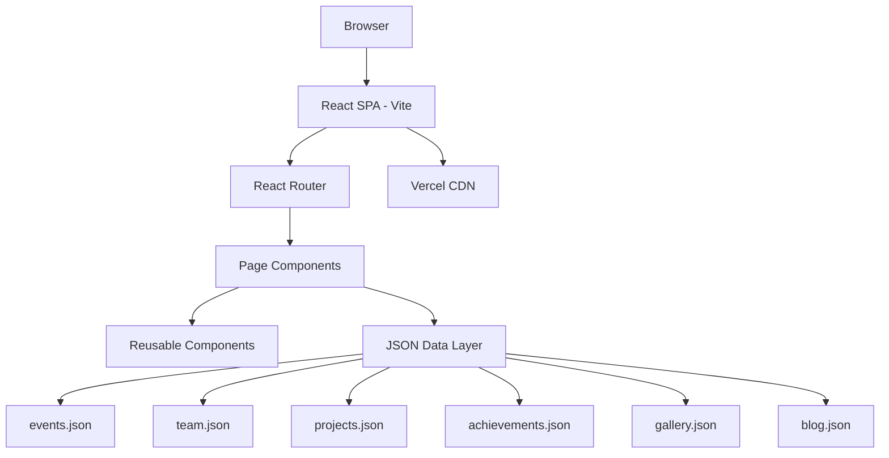

# ACM NMIMS Indore — Project Documentation

**WebSprint 2026 Submission**  
**Theme:** Preserving Legacy. Showcasing Innovation.  
**Author:** Chahak Gandhi
**Date:** 29 June 2026

---

## 1. Executive Summary

This document describes the architecture, modules, and implementation of the official ACM NMIMS Indore Student Chapter website. The site serves as a digital archive for two academic years of chapter activities, a recruitment platform, and a showcase for technical excellence.

## 2. System Architecture



### 2.1 Technology Stack

| Layer | Technology | Purpose |
|-------|-----------|---------|
| UI Framework | React 19 | Component-based UI |
| Build Tool | Vite | Fast dev server & bundling |
| Routing | React Router v7 | Client-side navigation |
| Styling | Tailwind CSS v4 | Utility-first responsive design |
| Data | Static JSON | Content management without backend |
| Hosting | Vercel | CDN deployment with SSL |

### 2.2 Design System

- **Theme:** Dark futuristic (WebSprint 2026 poster aesthetic)
- **Colors:** Navy (#0a0e1a), Cyan (#00d4ff), Purple (#8b5cf6), Pink (#ec4899)
- **Typography:** Orbitron (headings), Inter (body)
- **Effects:** Glassmorphism, gradient text, glow animations

## 3. Module Descriptions

### Module 1: Home Page
Landing page with hero section, animated statistics counter, vision/mission cards, upcoming events carousel, featured achievements, and Join ACM CTA.

### Module 2: About ACM & Chapter
Global ACM overview, local chapter info, objectives, core values (4 cards), chapter journey timeline (2023–2026), and faculty coordinator section.

### Module 3: Events Archive
10 events spanning 2024–2026 with filterable cards (Workshop/Hackathon/Talk/Webinar). Each event links to a detail page with speaker info, registration stats, and resources.

### Module 4: Gallery
Masonry grid with 7 category filters, lightbox view with keyboard (Esc) support, and video highlights placeholder.

### Module 5: Team & Leadership
7 sections: Faculty, Leadership, Core Committee, Technical, Design, Events, Alumni. Cards with LinkedIn/GitHub links and position timelines.

### Module 6: Project Showcase
6 projects across IoT, AI/ML, Web, Open Source, Research categories with tech stack badges and GitHub/demo links.

### Module 7: Achievements & Awards
Animated stats, competition wins, ACM recognitions, and chapter milestone timeline.

### Module 8: Live Event Tracking
Dismissible live announcement banner, countdown timer to WebSprint deadline, event status cards, registration progress bar, and simulated live attendance counter.

### Module 9: Membership & Recruitment
ACM benefits (6 cards), recruitment notice with submission form link, volunteer application form with validation, and FAQ accordion (8 questions).

### Additional: Blog & Contact
3 blog/newsletter cards and contact form with email validation.

## 4. Data Schema (JSON Structure)

### events.json
```json
{ "id", "title", "date", "type", "speaker", "description", "registrations", "certificate", "resources[]" }
```

### team.json
```json
{ "faculty[]", "leadership[]", "core[]", "technical[]", "design[]", "events[]", "alumni[]" }
// Each member: { "id", "name", "role", "department", "linkedin", "github", "timeline", "highlight" }
```

### projects.json
```json
{ "id", "title", "category", "description", "tech[]", "github", "demo", "year" }
```

## 5. User Workflows

1. **Visitor browses events:** Home → Events → Filter by type → Click event → View details
2. **Student joins ACM:** Home → Join ACM → Read benefits → Fill volunteer form → Success
3. **Recruiter views projects:** Projects → Filter by category → Click GitHub/Demo links
4. **Live event tracking:** Live → View countdown → Check registration progress

## 6. Deployment

1. `npm run build` generates static files in `/dist`
2. Vercel auto-deploys from GitHub on push
3. `vercel.json` configures SPA rewrites for client-side routing

## 7. Team Contribution

| Member | Role | Contribution |
|--------|------|-------------|
| [Your Name] | Full-Stack Developer | Architecture, all 9 modules, deployment, documentation |

*(Update with actual team members if applicable)*

## 8. Testing Checklist

- [x] All 11 routes navigate correctly
- [x] Event/Gallery/Project filters work
- [x] Forms validate and show success states
- [x] Gallery lightbox opens/closes (click + Esc key)
- [x] Countdown timer updates every second
- [x] Stats counter animates on scroll
- [x] Mobile responsive (hamburger menu)
- [x] No console errors

## 9. References

- [WebSprint 2026 Guidelines](https://nmimsindore.acm.org/web-sprint/)
- [ACM Student Chapter Portal](https://www.acm.org/education/student-chapters)
- Tailwind CSS v4 Documentation
- React Router v7 Documentation

---

